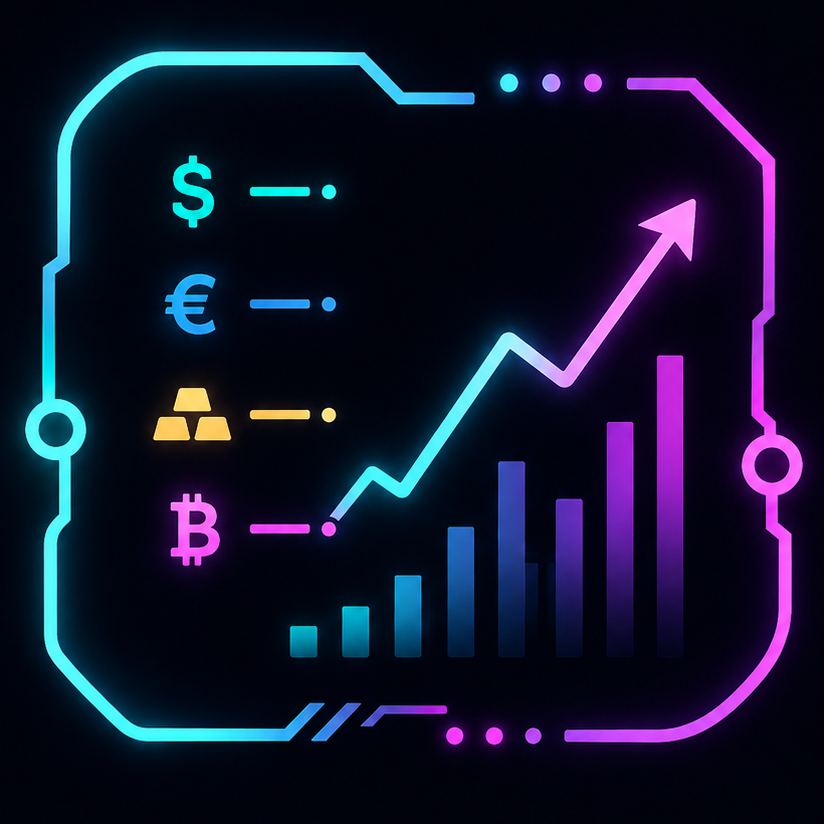
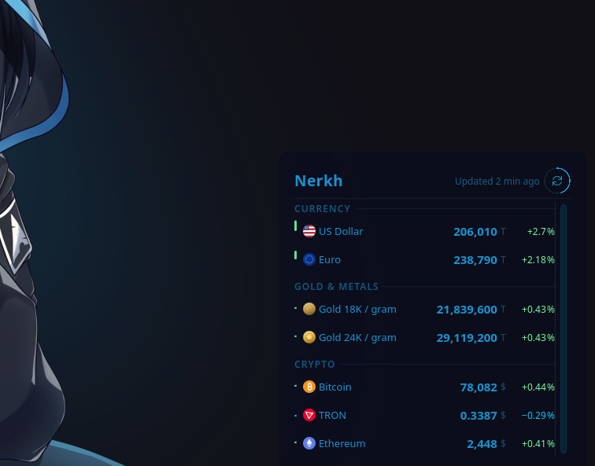
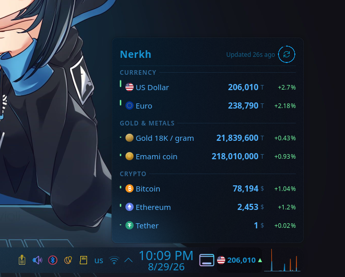
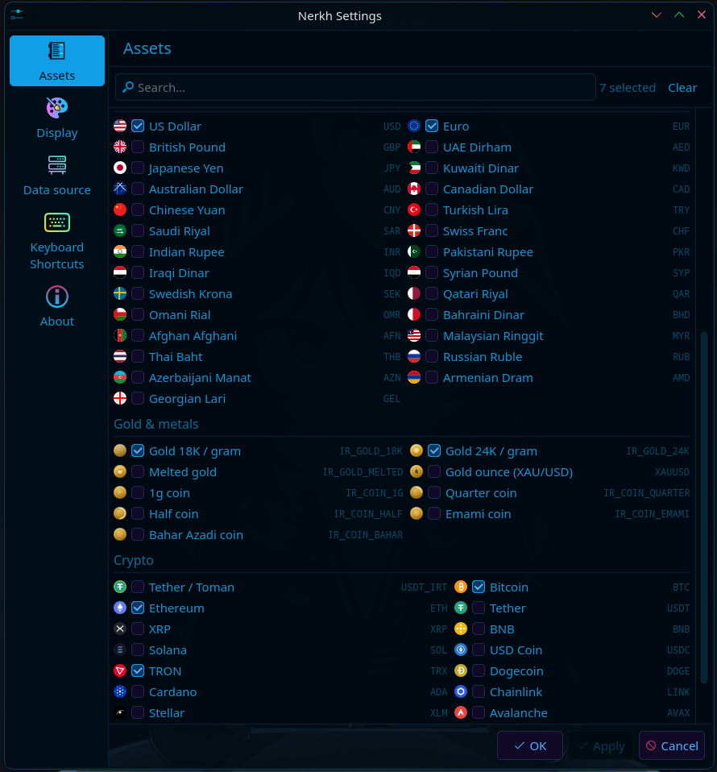
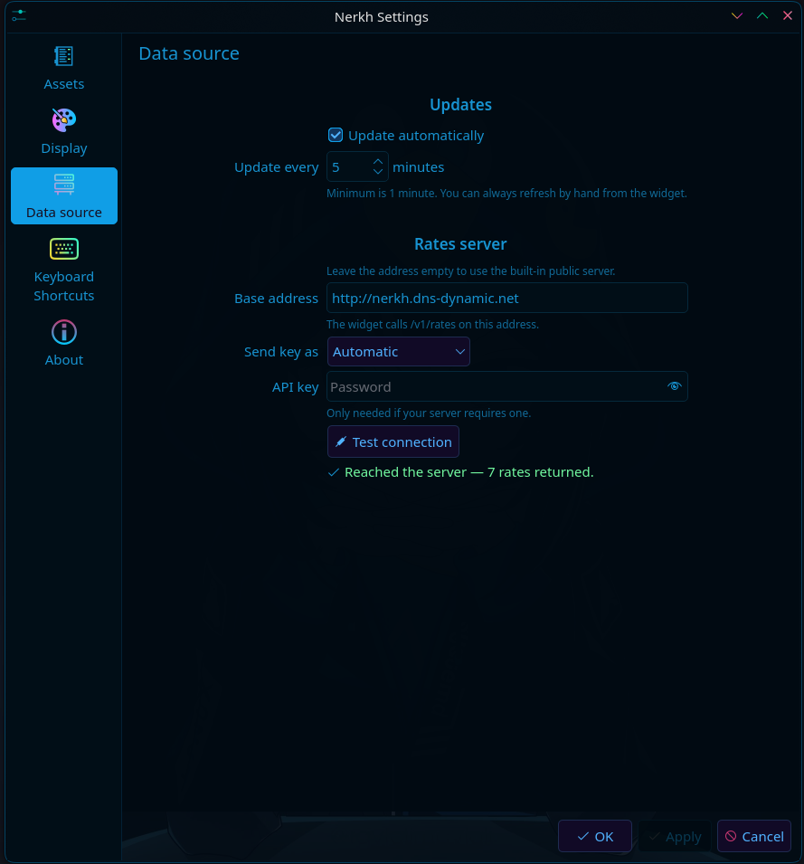
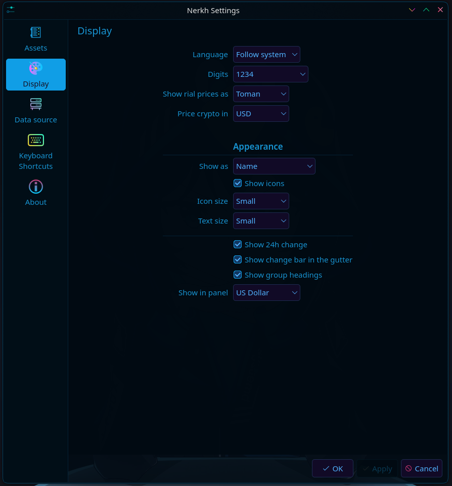

<div align="center">



# نرخ &nbsp;·&nbsp; Nerkh

### قیمت ارز، طلا، سکه و رمزارز؛ همیشه روی دسکتاپ KDE Plasma&nbsp;6 شما

<p>
  
  
  
  
</p>

<p>
  <a href="README.md">English</a> &nbsp;•&nbsp; <a href="README_FA.md"><b>فارسی</b></a>
</p>

<p>
  <a href="https://www.opendesktop.org/p/2369858/"><b>دریافت از فروشگاه KDE</b></a>
  &nbsp;·&nbsp; <a href="https://github.com/keyaruga33/nerkh-widget/releases">انتشارها</a>
  &nbsp;·&nbsp; <a href="SUPPORTED_ASSETS.md">دارایی‌های پشتیبانی‌شده</a>
  &nbsp;·&nbsp; <a href="https://github.com/keyaruga33/nerkh-widget/issues">گزارش خطا</a>
</p>

</div>

---

 &nbsp;**نرخ** ویجتی کوچک برای Plasma 6 است که قیمت چیزهایی را که پیگیری می‌کنید — ارزهای رایج، طلا، سکه‌های ایرانی و رمزارزها — درست روی دسکتاپ یا پنل نگه می‌دارد.

فکر پشت آن ساده است: برای عددی که روزی چند بار نگاهش می‌کنید، نباید هر بار مرورگر یا برنامه‌ای جداگانه باز کنید. بهتر است همان‌جا، بی‌دردسر و در دسترس باشد.

روی **دسکتاپ** قرارش دهید تا فهرست کامل را یک‌جا ببینید؛ در **پنل** بگذارید تا یک قیمت منتخب همیشه گوشهٔ چشمتان باشد. نرخ فارسی و انگلیسی را پشتیبانی می‌کند، با پوستهٔ سامانه هماهنگ می‌شود و وقتی چیزی برای به‌روزرسانی نیست، مزاحم پردازنده نمی‌شود.

##  &nbsp;تصاویر

<div align="center">

<table>
  <tr>
    <td align="center"><br><sub><b>دسکتاپ</b> — همهٔ فهرست، در یک نگاه</sub></td>
    <td align="center"><br><sub><b>پنل</b> — یک قیمت، همیشه در دسترس</sub></td>
  </tr>
</table>

<table>
  <tr>
    <td align="center"><br><sub>دارایی‌ها</sub></td>
    <td align="center"><br><sub>داده و ای پی آی</sub></td>
    <td align="center"><br><sub>نمایش</sub></td>
  </tr>
</table>

</div>

##  &nbsp;امکانات

برای آغاز کار، نه حساب کاربری لازم است، نه کلید API و نه تنظیمات پیچیده؛ ویجت را که اضافه کنید، آمادهٔ استفاده است.

###  &nbsp;۵۶ دارایی در سه گروه

ارزهای رایج، طلا و سکه‌های ایرانی و رمزارزها، در سه گروه **ارز**، **طلا و سکه** و **رمزارز** سامان یافته‌اند.

| گروه | تعداد | چند نمونه |
| ---- | :---: | ---- |
| ارزها | ۲۷ | دلار، یورو، پوند، درهم، لیر، یوان و … |
| طلا، فلز و سکه | ۹ | طلای ۱۸ عیار، سکهٔ بهار آزادی، سکهٔ امامی و … |
| رمزارزها | ۲۰ | بیت‌کوین، اتریوم، تتر و استیبل‌کوین‌های پرکاربرد |

فقط دارایی‌هایی را نمایش دهید که واقعاً دنبالشان می‌کنید. ترتیب دارایی‌ها در هر گروه و همچنین ترتیب خود گروه‌ها، هر دو در اختیار شماست.

>  فهرست کامل، همراه با نماد و نام فارسی و انگلیسی: **[دارایی‌های پشتیبانی‌شده](SUPPORTED_ASSETS.md)**

###  &nbsp;دسکتاپ یا پنل؛ انتخاب با شماست

- **روی دسکتاپ** به شکل فهرستی کامل از دارایی‌های فعال شما نمایش داده می‌شود.
- **در پنل** جمع‌وجور می‌شود و قیمت یک دارایی منتخب را نشان می‌دهد.

###  &nbsp;به‌روزرسانی در زمان دلخواه شما

زمان دریافت قیمت‌های تازه کاملاً قابل‌تنظیم است:

- به‌روزرسانی خودکار، از هر **۱ تا ۱۴۴۰ دقیقه**.
- به‌روزرسانی دستی، هر زمان که عدد تازه می‌خواهید.
- خاموش‌کردن کامل به‌روزرسانی خودکار و دریافت داده فقط هنگام نیاز.

###  &nbsp;فقط قیمت نیست؛ تغییرات امروز هم پیداست

عدد فعلی مهم است، اما دانستن مسیر حرکتش هم کمک می‌کند. نرخ برای هر دارایی می‌تواند این‌ها را نشان دهد:

- **میزان تغییر** به درصد.
- **افزایش یا کاهش** با رنگی که در یک نگاه مشخص است.
- **نوار تغییرات** برای دیدن سریع‌تر روند.
- **برچسب گروه‌ها** برای مرتب‌ماندن فهرست‌های بلند.

###  &nbsp;فارسی و انگلیسی، مطابق سلیقه و رسم شما

نرخ از ابتدا برای استفادهٔ فارسی‌زبانان در نظر گرفته شده و در عین حال انگلیسی را هم کامل پشتیبانی می‌کند:

- **زبان**: فارسی، انگلیسی یا زبان سامانه.
- **شماره‌ها**: فارسی (۱۲۳)، لاتین (123) یا خودکار.
- **تومان یا ریال** برای قیمت‌های داخلی.
- **دلار یا تومان** به‌عنوان مبنای نمایش رمزارزها.
- چیدمان درست راست‌به‌چپ در زبان فارسی.

###  &nbsp;هماهنگ با سامانه، مطابق سلیقهٔ شما

نرخ از همان ابتدا رنگ‌ها و ظاهر **پوستهٔ KDE / Qt** را دنبال می‌کند. سپس می‌توانید جزئیات زیادی را تغییر دهید:

- نمایش یا پنهان‌کردن **نماد هر دارایی**.
- **اندازهٔ نماد**: کوچک، متوسط یا بزرگ.
- **اندازهٔ نوشته**: کوچک، معمولی، بزرگ یا خیلی بزرگ.
- **برچسب‌ها**: نام دارایی، نماد آن یا هر دو.

###  &nbsp;دادهٔ رایگان، یا API خودتان

نرخ به‌طور پیش‌فرض از یک **منبع دادهٔ رایگان** استفاده می‌کند که داده‌ها را از چند فراهم‌کننده گردآوری می‌کند. بنابراین نیازی به نام‌نویسی یا واردکردن کلید نیست؛ کافی است ویجت را اضافه کنید.

اگر منبع مشخصی مدنظر دارید، می‌توانید آن را به **API خودتان** متصل کنید:

- تعیین **نشانی پایهٔ API**.
- انتخاب شیوهٔ **احراز هویت**: خودکار، توکن Bearer، سرآیند دلخواه، پارامتر درخواست یا بدون احراز هویت.
- واردکردن **کلید API**، در صورت نیاز.
- **آزمودن اتصال** از همان بخش تنظیمات و دیدن نتیجه یا خطا به‌صورت روشن.

##  &nbsp;نصب

###  &nbsp;راه آسان؛ فروشگاه KDE

1. روی پنل یا دسکتاپ راست‌کلیک کنید و **Add or Manage Widgets…** را بزنید.
2. به **Get New…** ← **Download New Plasma Widgets** بروید.
3. در کادر جست‌وجو، **Nerkh** را بنویسید.
4. آن را نصب کنید و سپس روی دسکتاپ یا پنل بکشید.

>  **[نرخ را در فروشگاه KDE ببینید →](https://www.opendesktop.org/p/2369858/)**

###  &nbsp;نصب از پروندهٔ انتشار

1. آخرین بسته را از صفحهٔ [انتشارها](https://github.com/keyaruga33/nerkh-widget/releases) دریافت کنید.
2. روی پنل راست‌کلیک کنید و به **Add or Manage Widgets…** ← **Get New…** بروید.
3. **Install From Local File…** را انتخاب کنید و پروندهٔ دریافت‌شده را بدهید.

###  &nbsp;نصب از کد منبع

```bash
git clone https://github.com/keyaruga33/nerkh-widget.git
cd nerkh-widget
make install
```

اگر ویجت دیده نشد، Plasma را دوباره راه‌اندازی کنید یا یک‌بار از حساب کاربری خارج و دوباره وارد شوید.

##  &nbsp;شخصی‌سازی

روی ویجت راست‌کلیک کنید و **Configure Nerkh** را برگزینید. تنظیمات در سه صفحه آمده‌اند:

<table>
  <tr>
    <td valign="top" width="33%">
      <b> دارایی‌ها</b><br><br>
      • انتخاب دارایی‌های قابل‌نمایش<br>
      • تغییر ترتیب درون هر گروه<br>
      • تغییر ترتیب گروه‌ها<br>
      • جست‌وجو با نام یا نماد
    </td>
    <td valign="top" width="33%">
      <b> نمایش</b><br><br>
      • زبان و شماره‌ها<br>
      • تومان / ریال و مبنای رمزارز<br>
      • برچسب‌ها، نمادها و اندازهٔ آن‌ها<br>
      • اندازهٔ نوشته، نوار تغییرات و برچسب گروه‌ها<br>
      • انتخاب دارایی نمایش‌داده‌شده در پنل
    </td>
    <td valign="top" width="33%">
      <b> داده و API</b><br><br>
      • روشن یا خاموش‌کردن به‌روزرسانی خودکار<br>
      • بازهٔ زمانی ۱ تا ۱۴۴۰ دقیقه<br>
      • نشانی پایهٔ API خودتان<br>
      • شیوهٔ احراز هویت و کلید API<br>
      • آزمودن اتصال
    </td>
  </tr>
</table>

##  &nbsp;منشأ قیمت‌ها

قیمت‌ها از یک منبع رایگان می‌آیند که اطلاعات چند فراهم‌کننده را کنار هم قرار می‌دهد. برای استفادهٔ روزمره هیچ تنظیمی لازم نیست: نه نام‌نویسی و نه کلید. اگر هم منبع دادهٔ خودتان را دارید، از صفحهٔ «داده و API» به آن وصل شوید.

> تازگی قیمت‌ها به همان اندازه است که منبع داده اجازه می‌دهد؛ بنابراین ممکن است گاهی اندکی با بازار لحظه‌ای اختلاف داشته باشند.

##  &nbsp;سبک و کم‌مصرف

یک ویجت کوچک نباید بی‌دلیل در پس‌زمینه کار کند. نرخ فقط در زمان‌بندی‌ای که تعیین کرده‌اید داده می‌گیرد؛ یا اگر به‌روزرسانی خودکار را خاموش کنید، فقط با درخواست شما. در باقی زمان‌ها آرام می‌ماند و پردازنده را درگیر نمی‌کند.

##  &nbsp;پیش‌نیازها

- **KDE Plasma 6**
- **Qt 6**

> نرخ برای KDE Plasma ساخته شده است و در میزکارهای غیر KDE، مانند GNOME، XFCE و Cinnamon، پشتیبانی نمی‌شود.

##  &nbsp;در ادامه

نرخ هنوز جای رشد دارد. برنامه‌های بعدی شامل این‌هاست:

- دارایی‌های بیشتر
- منابع دادهٔ بهتر
- گزینه‌های بیشتر برای شخصی‌سازی ظاهر
- حالت پنل کامل‌تر
- بهینه‌سازی بیشتر کارایی
- امکانات گسترده‌تر برای API

##  &nbsp;همراهی کنید

اگر خطایی دیدید، پیشنهادی دارید یا دلتان می‌خواهد نرخ کار تازه‌ای انجام دهد، خوشحال می‌شوم بشنوم:

-  برای گزارش خطا یا پیشنهاد قابلیت، **[یک issue باز کنید](https://github.com/keyaruga33/nerkh-widget/issues)**.
-  اگر مایلید در کد مشارکت کنید، مخزن را fork کنید و یک **pull request** بفرستید.

##  &nbsp;پروانه

نرخ آزاد و متن‌باز است و تحت پروانهٔ **[GPL-3.0](LICENSE)** منتشر می‌شود.

##  &nbsp;اگر دوستش داشتید

اگر نرخ روی دسکتاپتان جا باز کرد، یک **⭐ ستاره** در گیت‌هاب واقعاً دلگرم‌کننده است و به ادامهٔ کار کمک می‌کند.

و اگر خواستید از این پروژه حمایت کنید، می‌توانید من را به یک قهوه مهمان کنید:

>  **[دعوت به یک قهوه →](https://www.coffeete.ir/keyaruga333)**

##  &nbsp;پیوندها

| | |
| --- | --- |
|  گیت‌هاب | https://github.com/keyaruga33/nerkh-widget |
|  فروشگاه KDE | https://www.opendesktop.org/p/2369858/ |
|  انتشارها | https://github.com/keyaruga33/nerkh-widget/releases |
|  گزارش‌ها | https://github.com/keyaruga33/nerkh-widget/issues |
|  دارایی‌های پشتیبانی‌شده | [SUPPORTED_ASSETS.md](SUPPORTED_ASSETS.md) |

<div align="center">

<br>

 &nbsp;**ساخته‌شده برای KDE Plasma** &nbsp;·&nbsp;  &nbsp;_با نرخ، قیمت‌ها همیشه پیش چشم شما هستند._

</div>
