# Supported Assets

Everything Nerkh can track today — **56 assets** in all: world currencies, gold and metals, Iranian coins, and crypto. Each one comes with its own icon, so you spot it fast in a long list.

Jump to a group:

- [Currencies](#currencies) — 27
- [Gold, Metals & Coins](#gold-metals--coins) — 9
- [Crypto](#crypto) — 20

---

## Currencies

Everyday world money — dollar, euro, and the ones people around here actually check.

|   | Symbol | English | فارسی |
| :-: | ------ | ------- | ----- |
| 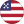 | `USD` | US Dollar | دلار آمریکا |
| 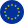 | `EUR` | Euro | یورو |
| 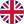 | `GBP` | British Pound | پوند انگلیس |
| 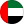 | `AED` | UAE Dirham | درهم امارات |
|  | `JPY` | Japanese Yen | ین ژاپن |
| 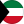 | `KWD` | Kuwaiti Dinar | دینار کویت |
|  | `AUD` | Australian Dollar | دلار استرالیا |
|  | `CAD` | Canadian Dollar | دلار کانادا |
| 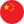 | `CNY` | Chinese Yuan | یوان چین |
| 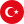 | `TRY` | Turkish Lira | لیر ترکیه |
| 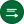 | `SAR` | Saudi Riyal | ریال عربستان |
|  | `CHF` | Swiss Franc | فرانک سوئیس |
| 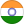 | `INR` | Indian Rupee | روپیه هند |
| 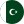 | `PKR` | Pakistani Rupee | روپیه پاکستان |
| 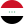 | `IQD` | Iraqi Dinar | دینار عراق |
|  | `SYP` | Syrian Pound | لیر سوریه |
| 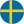 | `SEK` | Swedish Krona | کرون سوئد |
|  | `QAR` | Qatari Riyal | ریال قطر |
| 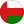 | `OMR` | Omani Rial | ریال عمان |
|  | `BHD` | Bahraini Dinar | دینار بحرین |
| 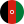 | `AFN` | Afghan Afghani | افغانی افغانستان |
| 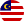 | `MYR` | Malaysian Ringgit | رینگیت مالزی |
|  | `THB` | Thai Baht | بات تایلند |
| 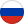 | `RUB` | Russian Ruble | روبل روسیه |
| 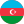 | `AZN` | Azerbaijani Manat | منات آذربایجان |
| 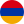 | `AMD` | Armenian Dram | درام ارمنستان |
| 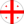 | `GEL` | Georgian Lari | لاری گرجستان |

**27 currencies**

---

## Gold, Metals & Coins

Gold by the gram, the global ounce, and the Iranian coins — from the one-gram piece up to a full Bahar Azadi.

|   | Symbol | English | فارسی |
| :-: | ------ | ------- | ----- |
| 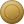 | `IR_GOLD_18K` | Gold 18K / gram | طلای ۱۸ عیار |
| 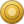 | `IR_GOLD_24K` | Gold 24K / gram | طلای ۲۴ عیار |
| 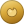 | `IR_GOLD_MELTED` | Melted Gold | طلای آب‌شده |
| 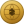 | `XAUUSD` | Gold Ounce (XAU/USD) | انس جهانی طلا |
| 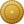 | `IR_COIN_1G` | 1g Coin | سکهٔ یک گرمی |
| 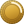 | `IR_COIN_QUARTER` | Quarter Coin | ربع سکه |
| 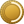 | `IR_COIN_HALF` | Half Coin | نیم سکه |
| 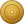 | `IR_COIN_EMAMI` | Emami Coin | سکهٔ امامی |
| 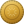 | `IR_COIN_BAHAR` | Bahar Azadi Coin | سکهٔ بهار آزادی |

**9 gold, metal & coin assets**

---

## Crypto

The big coins and the stablecoins — including Tether priced straight in Toman.

|   | Symbol | English | فارسی |
| :-: | ------ | ------- | ----- |
| 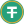 | `USDT_IRT` | Tether / Toman | تتر / تومان |
| 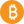 | `BTC` | Bitcoin | بیت‌کوین |
| 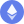 | `ETH` | Ethereum | اتریوم |
| 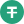 | `USDT` | Tether | تتر |
|  | `XRP` | XRP | ریپل |
| 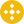 | `BNB` | BNB | بی‌ان‌بی |
|  | `SOL` | Solana | سولانا |
|  | `USDC` | USD Coin | یو‌اس‌دی‌کوین |
|  | `TRX` | TRON | ترون |
| 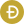 | `DOGE` | Dogecoin | دوج‌کوین |
|  | `ADA` | Cardano | کاردانو |
|  | `LINK` | Chainlink | چین‌لینک |
| 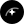 | `XLM` | Stellar | استلار |
|  | `AVAX` | Avalanche | آوالانچ |
|  | `SHIB` | Shiba Inu | شیبا اینو |
| 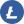 | `LTC` | Litecoin | لایت‌کوین |
|  | `DOT` | Polkadot | پولکادات |
|  | `UNI` | Uniswap | یونی‌سواپ |
|  | `ATOM` | Cosmos | کازموس |
| 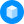 | `FIL` | Filecoin | فایل‌کوین |

**20 cryptocurrencies**

---

## At a glance

| Group | Count |
| ----- | ----: |
| Currencies | 27 |
| Gold, Metals & Coins | 9 |
| Crypto | 20 |
| **Total** | **56** |

> This list grows over time as new assets land in Nerkh.

---

[← Back to Nerkh](README.md)
